## 이슈
스프링 시큐리티와 JWT를 사용해서 계정을 인증하는 기능을 개발 하던 중 권한에 관한 이슈가 발생했다.  
계정 등록 & 로그인 API 호출 시 생성되는 토큰은 정상적으로 발급되도록 개발을 마쳤다.  
문제는 권한 설정을 하고 나서 문제가 발생했는데, SecurityConfig 클래스에서 `/accounts/info/**` 하위로 들어오는 엔드포인트에 대한 권한 설정은 `GENERAL` 권한이 있는 계정만 접근 가능하도록 아래와 같이 설정했다.

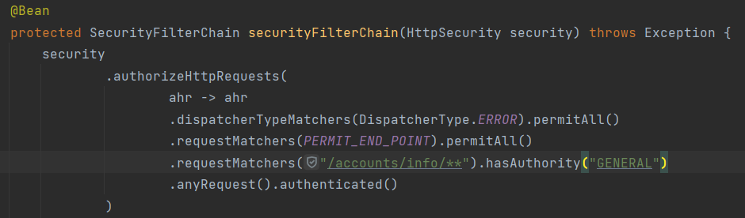

그런데 해당 권한을 설정하고 나서 API를 호출 해보니 403 응답이 돌아왔다.

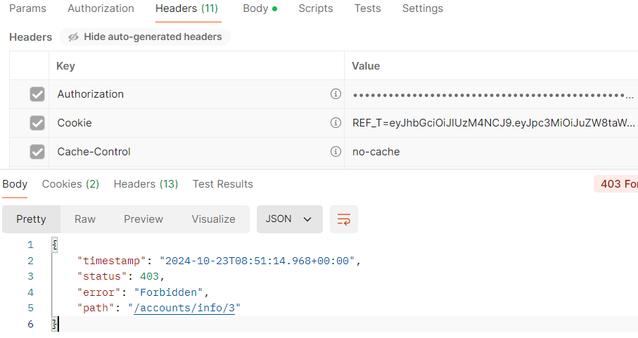

요청을 보낼 때 헤더에 토큰 값도 제대로 들어가 있고, 해당 API 호출 시 토큰을 검증하는 필터도 잘 타고, 토큰 파싱 값도 잘 나오고 `SecurityContextHolder`객체에 인증 객체도 잘 들어가는데 뭐가 문제인지 찾지 못해서 반나절 가량 헤맸다.

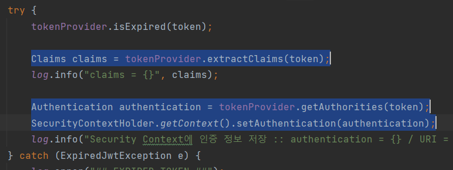

사실 직접 디버깅 해 가면서 문제를 찾는 습관을 들여야 하는데 자꾸 구글링만 하고 앉아 있다가 시간을 너무 버리는 것 같아서 직접 디버깅을 해보기로 했다.

## 발생 원인
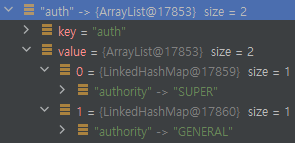  
파싱된 클레임을 보다보니 권한(`"auth"`) 값이 좀 이상하다. 문자열 타입의 리스트를 넣었다고 생각 했는데 아니었다. 그리고 리스트 형태로 만든 것 자체를 잘못 된 것이 권한이 여러개라고 한다면 그냥 문자열을 콤마로 구분 지어서 넣을 생각이었다. `ex) "SUPER,GENERAL"`  

## 해결 과정
먼저 403 에러가 났기 때문에 로그를 확인 하려 했는데 root 로깅 레벨을 `info`로 설정 해놔서 스프링 시큐리티 필터에 대한 로그가 콘솔에 찍히지 않아 `trace`로 변경해서 다시 확인 해 보았다.
위의 원인을 찾기 위해서 스프링 시큐리티 필터가 동작하는 순서를 먼저 파악해야 했다. 

Security 설정 파일에서 `UsernamePasswordAuthenticationFilter` 전에 토큰 필터가 호출 되도록 설정 해놨기 때문에 아래처럼 `UsernamePasswordAuthenticationFilter` 타기 전에 `JwtFilter` 로그가 먼저 찍히는 것을 볼 수 있다.

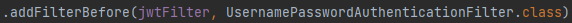
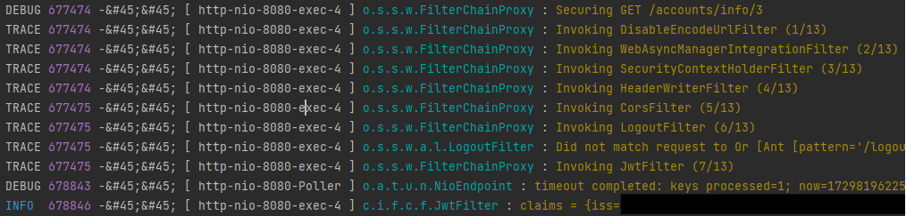

클레임을 만들때 `SimpleGrantedAuthority` 객체 타입의 컬렉션을 넣었기 때문에 `AbstractAuthenticationToken` 클래스 생성자로 넘어온 권한 컬렉션 값이 아래와 같이 들어가 있는 것을 볼 수 있었다.

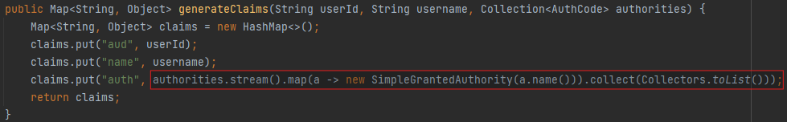
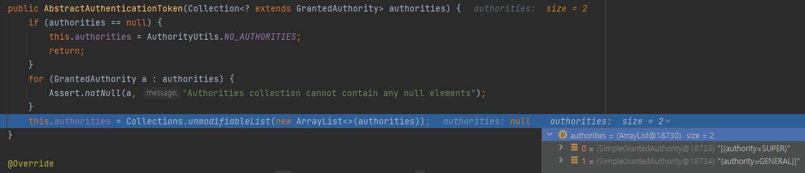

이후에 `FilterChainProxy`에 의해 호출된 다음 필터들을 보면 `UsernamePasswordAuthenticationFilter`가 호출된 로그가 없는데

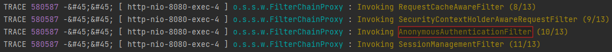

그 다음에 찍힌 로그를 보니 이미 `UsernamePasswordAuthenticationToken`에 대한 인증이 되었으므로 `SecurityContextHolder`를 세팅하지 않았다는 메세지가 뜬다. 말 그대로 이미 인증되었으니 `UsernamePasswordAuthenticationFilter`를 호출할 필요가 없다는 말이다.

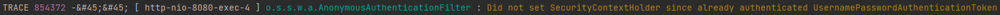

아무튼 필터 호출 순서보다는 403 원인 파악이 되었으니 일단 저런식으로 권한 컬렉션을 넘기면 왜 403 에러가 나는 지 확인 해봐야 한다. `AuthorizationFilter`가 마지막에 호출 되는데

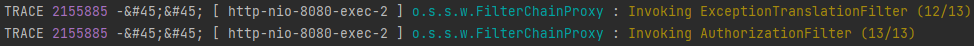

`AuthoritiesAuthorizationManager`의 `check()` 메서드에서 권한 체크를 하게 된다.  

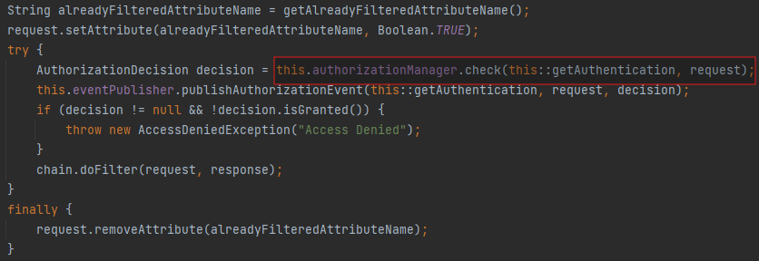

첫번째 parameter인 `authentication`은 토큰에서 파싱한 체크할 권한 컬렉션 값이고, 두번째 paramter인 `authorities`는 Security 설정파일에서 설정한 권한에 대한 컬렉션 값 이다.

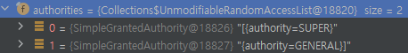

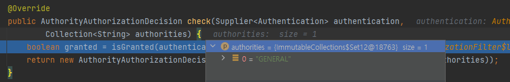

`isGranted` 메서드에서 authentication의 null 체크와 `isAuthorized`메서드의 리턴 값을 받아 리턴한다.

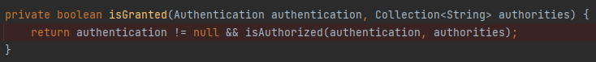

문제는 이 부분인데, 넘어온 authentication 컬렉션이 loop를 돌면서 비교를 하게 된다.

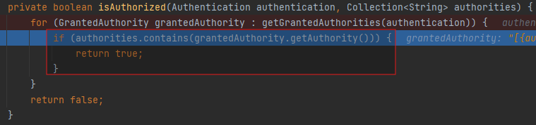

Security 설정파일에 설정한 권한은 `"GENERAL"` 문자열인데


아래처럼 중괄호까지 문자열로 묶여서 들어왔기 때문에 비교한다 한들... `true`를 리턴 할 수가 없다.

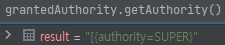
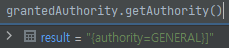

그 결과 `isGranted()`는 `false`를 리턴하게 되고, `isGranted` 값이 false를 가지는 `AuthorityAuthorizationDecision`객체를 리턴하게 된다.  
최종적으로 `AccessDeniedException`이 터지면서 403 에러를 냈다.

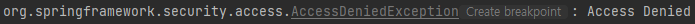

## 해결 방법
parameter로 넘어온 권한(`authorities`) 컬렉션 값을 아래와 같이 문자열로 바꿔서 넣어 주었다.
```java
// 기존
claims.put("auth", authorities.stream().map(a -> new SimpleGrantedAuthority(a.name())).collect(Collectors.toList()));
// 변경
claims.put("auth", authorities.stream().map(a -> a.name()).collect(Collectors.joining(",")));
```

주의하지 않은 실수지만 디버깅을 통해 해결했으니 남겨본다.